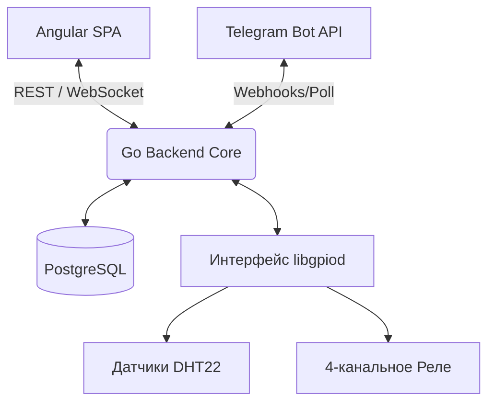

# Платформа Климат-Контроля Террариума
**Архитектура Системы и Техническая Спецификация**

---

## 1. Полная Техническая Спецификация (TDD)

### 1.1 Обзор
Платформа Климат-Контроля Террариума — это IoT-система промышленного уровня, созданная для Raspberry Pi 5. Она предназначена для автономного управления микроклиматом в террариуме Exo Terra 120x40x60 для тигрового питона. Система ориентирована на высокую надежность, механизмы отказоустойчивости, отслеживание энергопотребления и безопасное удаленное управление через frontend на Angular и интеграцию с Telegram-ботом.

### 1.2 Основные Требования
- **Аппаратная Платформа**: Raspberry Pi 5 (4GB RAM) под управлением Raspberry Pi OS.
- **Датчики**: 2x датчика DHT22 (Теплая зона, Холодная зона) с использованием `gpiod`.
- **Исполнительные Устройства**: 4x реле с управлением через GPIO (Термоковрик, Генератор тумана, Освещение, Запасная розетка). Нагревательный элемент занимает 1/3 площади дна.
- **Механизм Отказоустойчивости**: При запуске системы все реле по умолчанию переходят в состояние **ВЫКЛ**. При чистой перезагрузке состояние восстанавливается из сохраненного JSON-файла/БД. 
- **Аварийные Температурные Отключения**:
  - Температура в холодной зоне превышает заданный максимум -> Обогрев отключается.
  - Температура в теплой зоне превышает `emergency_max` (35°C) -> ВСЁ ВЫКЛЮЧАЕТСЯ + Экстренное оповещение в Telegram.
- **Отслеживание Энергопотребления**: Вычисление метрик на основе времени активной работы реле, умноженного на заданную пользователем мощность.

### 1.3 Режимы Работы
- **РУЧНОЙ РЕЖИМ (MANUAL)**: Цикл автоматизации остановлен. Пользователь может напрямую управлять всеми 4 реле через UI или API.
- **АВТОМАТИЧЕСКИЙ РЕЖИМ (AUTO)**: Механизм автоматизации управляет реле на основе потоков данных с датчиков, заданных пороговых значений и параметров расписания освещения. Учитывается гистерезис для предотвращения частого переключения (дребезга).

---

## 2. Высокоуровневая Архитектура

Платформа использует стандартную архитектуру IoT Edge и разделена на независимые микросервисы, разворачиваемые через Docker на Raspberry Pi.

1. **Frontend**: Angular SPA, обслуживаемый через Nginx (или статический обработчик Go), выступающий в роли основной панели управления.
2. **Backend**: Golang REST + WebSocket API. Организует логику автоматизации и взаимодействие с оборудованием.
3. **База Данных**: PostgreSQL для хранения исторических данных с датчиков, логов и пользовательских конфигураций.
4. **Аппаратный Уровень**: CGo или нативный интерфейс `libgpiod`, обеспечивающий неблокирующий опрос GPIO.

---

## 3. Детальная Архитектура Компонентов

### 3.1 Backend Ядро (Golang)
Построено на принципах **Clean Architecture** (Чистой Архитектуры).

- **`cmd/`**: Точки входа (`server`). Инициализация пулов соединений с БД, контекстов GPIO и маршрутизаторов HTTP.
- **`internal/api`**: Слой контроллеров для REST endpoint'ов и WebSocket хаба. Обрабатывает валидацию и сериализацию.
- **`internal/automation`**: Мозг системы. Постоянно работающая горутина (Конечный Автомат), проверяющая правила каждый цикл (например, каждые 2 секунды). Вычисляет переходы состояний с использованием буфера гистерезиса.
- **`internal/gpio`**: Уровень Аппаратных Абстракций (HAL). Взаимодействует с `libgpiod`. Предоставляет интерфейсы для мокирования при TDD (`RelayController`, `SensorReader`).
- **`internal/sensor`**: Независимые горутины, опрашивающие датчики DHT22. Отправляют данные в канал Go, который потребляется модулями `automation` и `api` (для WebSocket).
- **`internal/energy`**: Слушатель событий, отслеживающий изменения состояния реле. Вычисляет киловатт-часы (кВт⋅ч) и записывает агрегированные данные в БД.
- **`internal/telegram`**: Фоновый воркер, интегрирующийся с Telegram API. Отправляет уведомления, инициированные механизмом `automation`.

### 3.2 Frontend (Angular)
- **Управление Состоянием**: NgRx или сигналы (signals) для хранения телеметрии с датчиков в реальном времени.
- **Слой Компонентов**:
  - `Dashboard`: Анимированные датчики в реальном времени, текущий активный режим, быстрые переключатели.
  - `Charts`: Визуализация временных рядов с помощью Chart.js/ECharts (Температура, Влажность и Потребление энергии).
  - `Settings`: Формы для настройки порогов, расписаний и переопределений режимов.
- **Сервисы**: `ApiService` (синхронизация REST), `LiveStreamService` (RxJS WebSocket).

---

## 5. Спецификация API Endpoints

### 5.1 REST API (JSON)
Все endpoint'ы имеют префикс `/api/v1`

**Система и Конфигурация**
- `GET /config` : Получить текущие настройки автоматизации.
- `PUT /config` : Обновить климатические параметры и пороги.
- `GET /system/status` : Аптайм, статус БД, текущий активный режим.
- `POST /system/mode` : Переключение между режимами `AUTO` и `MANUAL`.

**Оборудование/Реле (Только для режима MANUAL)**
- `GET /relays` : Текущее состояние всех 4 реле.
- `POST /relays/:id/toggle` : Принудительное переключение конкретного реле.

**Метрики и Логи**
- `GET /metrics/sensors?range=24h` : Исторические данные температуры/влажности.
- `GET /metrics/energy?period=monthly` : Агрегация потребления энергии.

### 5.2 WebSocket API
- `ws://<host>/api/v1/stream`
  - Отправляет телеметрию в реальном времени каждые 2 секунды: `{"type": "telemetry", "warm_t": 32.1, "warm_h": 60.5, "cold_t": 25.0, ...}`
  - Отправляет изменения состояния реле мгновенно: `{"type": "relay_update", "relay_id": "heat_mat", "state": true}`

---

## 6. Описание Логики Автоматизации

Механизм Автоматизации — это неблокирующая фоновая Горутина, реализующая Конечный Автомат с Гистерезисом.

### 6.1 Цикл Оценки Состояния
Каждые *N* секунд:
1. **Чтение Датчиков**: Получение последних данных из буфера DHT22.
2. **Оценка Аварийных Отключений** (Наивысший Приоритет):
   - Если `Warm_Temp >= 35.0`: АВАРИЙНОЕ СОСТОЯНИЕ. Отключить все реле. Отправить уведомление в Telegram. Заблокировать работу до ручного сброса.
   - Если `Cold_Temp >= Config.Cold_Max`: Немедленно отключить реле обогрева. Игнорировать обычный гистерезис.
3. **Если Режим == AUTO**:
   - **Температура**: Если `Warm_Temp <= Config.Warm_Target_Min - Hysteresis` -> Обогрев ВКЛ. Если `Warm_Temp >= Config.Warm_Target_Max + Hysteresis` -> Обогрев ВЫКЛ.
   - **Влажность**: Если `Humidity <= Config.Humidity_Min` -> Туман ВКЛ. Если `Humidity >= Config.Humidity_Max` -> Туман ВЫКЛ.
   - **Освещение**: Проверка текущего системного времени в соответствии с заданным пользователем расписанием/cron. Освещение ВКЛ, если попадает в окно расписания, иначе ВЫКЛ.
4. **Сохранение Состояния**: Если какое-либо реле изменило состояние, записать резервную копию в `system_state.json` и залогировать в таблицу `relay_logs` в БД.

---

## 9. План Коммитов (Commit Roadmap)

**Фаза 1 – Ядро Backend'а и Аппаратные Абстракции**
1. `init: инициализация go модуля и структуры папок`
2. `feat(gpio): реализация HAL libgpiod для переключения реле`
3. `feat(sensor): реализация неблокирующей рутины чтения DHT22`
4. `test(gpio): добавление аппаратных моков для юнит-тестирования`

**Фаза 2 – Механизм Автоматизации**
5. `feat(automation): реализация базового FSM и переключения режимов`
6. `feat(automation): применение логики гистерезиса и пороговых значений`
7. `feat(automation): реализация аварийного отключения и температурной защиты`

**Фаза 3 – Интеграция с БД**
8. `feat(db): реализация чистой схемы PostgreSQL и миграций`
9. `feat(storage): интеграция слоя хранения датчиков и реле`
10. `feat(config): интеграция загрузки конфигурации из БД/JSON`

**Фаза 4 – API и WebSockets**
11. `feat(api): реализация REST endpoint'ов для конфигурации и ручного управления`
12. `feat(api): реализация WebSocket хаба для отправки телеметрии`

**Фаза 5 – Frontend**
13. `init: настройка рабочего пространства Angular и стилей material/tailwind`
14. `feat(ui): создание дэшборда реального времени и компонентов индикаторов`
15. `feat(ui): создание панели настроек и визуализации графиков`

**Фаза 6 – Telegram и Отслеживание Энергии**
16. `feat(telegram): интеграция bot api для уведомлений и команд статуса`
17. `feat(energy): реализация счетчика потребления на основе времени работы`

**Фаза 7 – Докеризация и CI/CD**
18. `chore(docker): создание multi-stage файлов сборки и compose для системы`
19. `docs: обновление документации по развертыванию и распиновке оборудования`

---

## 10. Анализ Рисков

| Риск | Влияние | Вероятность | Смягчение Последствий |
|------|---------|-------------|-----------------------|
| **Ошибки чтения DHT22** | Высокое | Средняя | Реализовать логику 3-х повторов. Переходить к безопасному отключению обогрева, если данные старые более 1 мин. Отправлять оповещение в Telegram. |
| **Отключение питания/Цикл перезагрузок** | Среднее | Низкая | Загрузка кэша `system_state.json` при старте. Система инициализируется в режиме "ВСЁ ВЫКЛ" до проверки конфигурации. |
| **Повреждение БД на SD-карте** | Высокое | Низкая | Использовать отдельный volume Docker. Снизить частоту записи (пакетная вставка данных с датчиков раз в 1 мин). |
| **Залипание реле (Механическое)** | Критичное | Очень низкая | Рекомендовать использование SSR (твердотельные реле) в спецификации оборудования вместо механических. Софт не может починить сваренные контакты, поэтому аварийные температурные отключения обязательны. |
| **Утечка памяти в Watcher'е**| Среднее | Низкая | Строгое отслеживание утечек горутин при тестировании. Доступны endpoint'ы Pprof для отладки. |

---

## 11. Возможности Будущего Расширения
1. **Канал видеонаблюдения**: Интеграция RTSP потока (например, с Pi Camera) напрямую в дэшборд Angular.
2. **Машинное обучение для прогнозирования**: Обучение небольшой модели для прогнозирования времени включения термоковрика на основе температуры в комнате (если добавить 3-й датчик снаружи).
3. **Продвинутое диммирование UVB/UVA**: Переключение реле освещения на GPIO с поддержкой PWM для имитации рассвета/заката.
4. **Датчик уровня воды**: Добавление поплавкового выключателя в резервуар генератора тумана и отправка уведомления в Telegram перед пересыханием.
